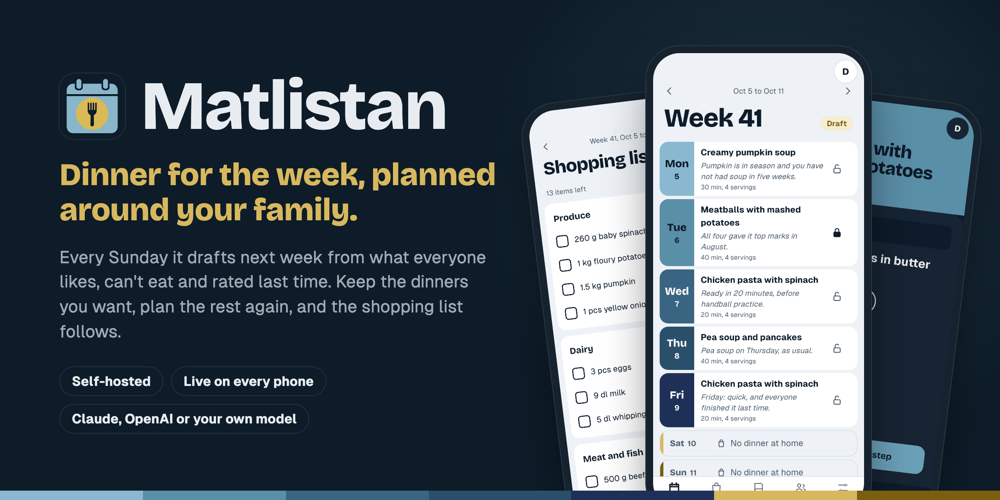
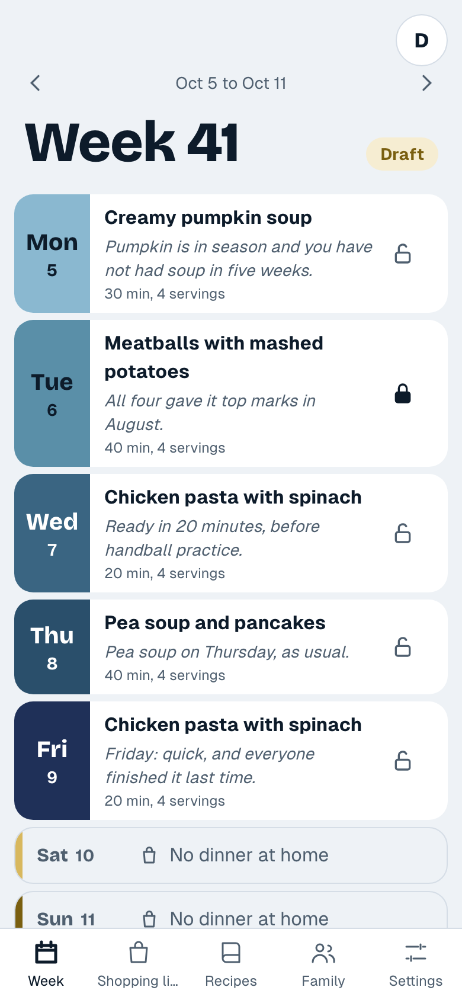
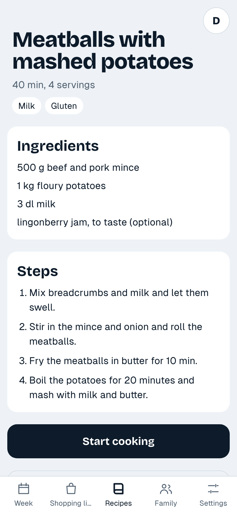
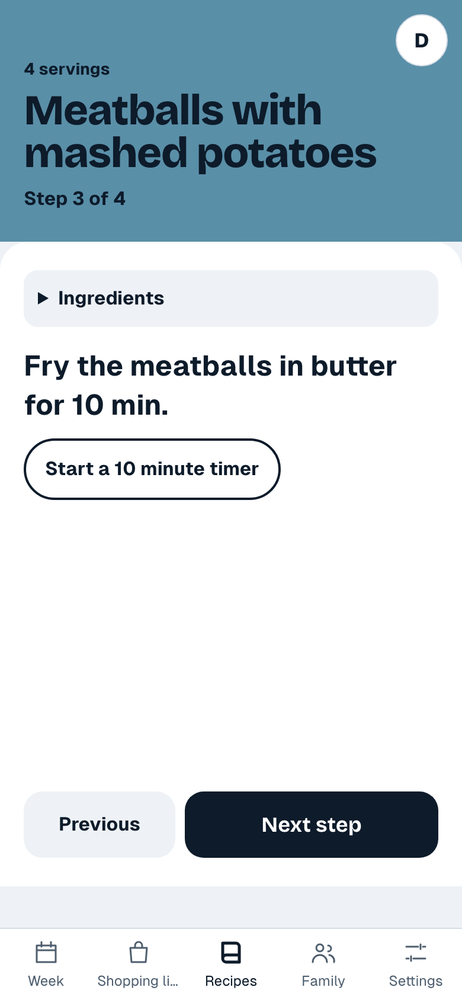
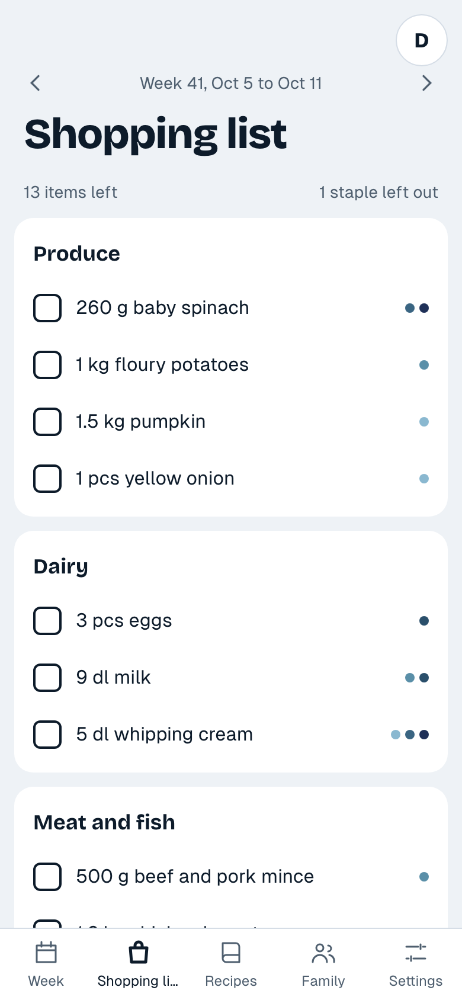

# Matlistan

A weekly meal planner for the household. Every Sunday it drafts next week's
dinners from the family's preferences, ages, allergies and history. You lock
the dinners you want to keep, plan the rest again and approve the week, and it
produces a shopping list that an iOS Shortcut pulls into Apple Notes. Recipes can be typed in or imported from a link to a recipe page.

  <picture>
    <source media="(prefers-color-scheme: dark)" srcset="docs/screenshots/week-dark.png">
    
  </picture>
  <picture>
    <source media="(prefers-color-scheme: dark)" srcset="docs/screenshots/recipe-dark.png">
    
  </picture>
  <picture>
    <source media="(prefers-color-scheme: dark)" srcset="docs/screenshots/cook-dark.png">
    
  </picture>
  <picture>
    <source media="(prefers-color-scheme: dark)" srcset="docs/screenshots/shopping-dark.png">
    
  </picture>

Status: in use at home. Everyone in the household sees the same week, live, on their own phone.

## Development

Tools come from `mise install`. Tests need Docker or Podman (testcontainers).

    mise run dev:db    # throwaway Postgres on :5432
    mise run devidp    # fake OIDC provider on 127.0.0.1:5556
    mise run dev       # http://localhost:8080

`mise run test`, `mise run lint`, `mise run templ` and `mise run css` cover the rest.
See [docs/shortcut.md](docs/shortcut.md) for putting the shopping list in Apple Notes.
`hack/screenshots.sh` takes every screen at phone size, the README's images in
`docs/screenshots` and the banner from `hack/banner.html`; it needs the dev stack, seeded with `mise run dev:seed`.

## Run it

Matlistan needs PostgreSQL, an OpenID Connect provider to sign in with, and an API key for
Anthropic, OpenAI or an OpenAI-compatible server. English is the default; set
`MATLISTAN_LOCALE=sv` and `MATLISTAN_TIMEZONE=Europe/Stockholm` for Swedish.

**Docker Compose.** [deploy/compose](deploy/compose) runs Matlistan and PostgreSQL on one
host; [docs/compose.md](docs/compose.md) walks through it:

    cd deploy/compose
    cp .env.example .env        # then fill it in, and create the secrets
    docker compose up -d

**Kubernetes.** The Helm chart is in `charts/matlistan` and published to
`oci://ghcr.io/aldersfors/helm-charts/matlistan`; [docs/deploy.md](docs/deploy.md) walks through
the Secrets, the OIDC client and an install. `mise run chart:test` renders and checks it.

## Licence

[Apache License 2.0](LICENSE)
